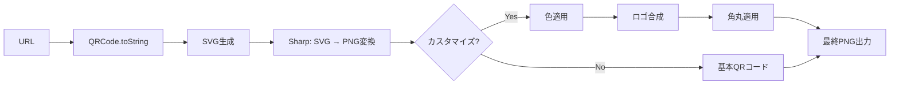

# QRコード生成エンジン 完全実装ガイド - QR Designer v3.0

## 📚 目次

1. [QRコード技術の基礎](#qrコード技術の基礎)
2. [ライブラリ選定と統合](#ライブラリ選定と統合)
3. [高品質画像生成パイプライン](#高品質画像生成パイプライン)
4. [カスタマイズ機能実装](#カスタマイズ機能実装)
5. [ロゴ合成と画像処理](#ロゴ合成と画像処理)
6. [パフォーマンス最適化](#パフォーマンス最適化)
7. [本番環境での考慮事項](#本番環境での考慮事項)

---

## QRコード技術の基礎

### QRコードの構造

```
┌─────────────────────────────────────┐
│ ┏━━━┓         ┏━━━┓               │
│ ┃███┃         ┃███┃  ← 位置検出パターン
│ ┃█ █┃         ┃█ █┃     (Finder Pattern)
│ ┃███┃         ┃███┃               │
│ ┗━━━┛         ┗━━━┛               │
│                                    │
│         [データ領域]                │
│    (エラー訂正 + 実データ)           │
│                                    │
│ ┏━━━┓                             │
│ ┃███┃  ← 位置検出パターン            │
│ ┃█ █┃                             │
│ ┃███┃         [タイミングパターン]  │
│ ┗━━━┛                             │
└─────────────────────────────────────┘
```

### エラー訂正レベル

| レベル | 訂正能力 | 推奨用途 | データ容量 |
|--------|---------|---------|----------|
| L (Low) | ~7% | デジタル表示専用 | 最大 |
| M (Medium) | ~15% | 通常用途 | 大 |
| Q (Quartile) | ~25% | **推奨（QR Designer）** | 中 |
| H (High) | ~30% | 汚れ・損傷想定 | 最小 |

**QR Designer v3.0の選択: Q (Quartile)**
- ロゴ挿入時の安全性確保
- スキャン成功率とデータ容量のバランス

### バージョンとデータ容量

```typescript
// 英数字モードの最大文字数
const MAX_CHARS = {
  1: 25,   // 21x21モジュール
  10: 174, // 57x57モジュール
  20: 370, // 97x97モジュール
  40: 1852 // 177x177モジュール（最大）
}

// URLの自動バージョン選択
function selectVersion(url: string): number {
  const length = url.length

  if (length <= 100) return 10  // 通常のURL
  if (length <= 200) return 15  // 長いURL
  if (length <= 300) return 20  // 非常に長いURL
  return 25 // 極端に長いURL
}
```

---

## ライブラリ選定と統合

### 主要QRコードライブラリ比較

| ライブラリ | カスタマイズ | サーバー対応 | バンドルサイズ | 品質 | 判定 |
|-----------|------------|------------|-------------|------|------|
| qrcode | ⭐⭐ | ✅ | 42KB | ⭐⭐⭐⭐ | ✅ |
| qrcode-generator | ⭐ | ✅ | 15KB | ⭐⭐⭐ | ❌ |
| node-qrcode | ⭐⭐⭐ | ✅ | 58KB | ⭐⭐⭐⭐ | ✅ |
| qr-code-styling | ⭐⭐⭐⭐⭐ | ❌ | 156KB | ⭐⭐⭐⭐⭐ | ❌ クライアントのみ |
| awesome-qr | ⭐⭐⭐⭐ | ⚠️ | 89KB | ⭐⭐⭐⭐ | ❌ 複雑 |

**選定: `qrcode` + `sharp`**
- サーバーサイド対応（Next.js API Routes）
- 軽量（42KB）
- シンプルなAPI
- Sharpで後処理してカスタマイズ強化

### パッケージインストール

```bash
# QR生成ライブラリ
npm install qrcode

# 画像処理ライブラリ
npm install sharp

# 型定義
npm install -D @types/qrcode
```

### 基本的な統合

```typescript
// lib/qr/generator.ts
import QRCode from 'qrcode'
import sharp from 'sharp'

/**
 * 基本的なQRコード生成
 */
export async function generateBasicQR(url: string): Promise<Buffer> {
  // SVG形式で生成（高品質）
  const qrSvg = await QRCode.toString(url, {
    type: 'svg',
    width: 512,
    margin: 1,
    errorCorrectionLevel: 'Q',
    color: {
      dark: '#000000',
      light: '#FFFFFF'
    }
  })

  // SVGをPNGに変換
  const pngBuffer = await sharp(Buffer.from(qrSvg))
    .resize(512, 512)
    .png({ quality: 95, compressionLevel: 9 })
    .toBuffer()

  return pngBuffer
}
```

---

## 高品質画像生成パイプライン

### レンダリングフロー



### 完全な生成パイプライン実装

```typescript
// lib/qr/generator.ts
import QRCode from 'qrcode'
import sharp from 'sharp'
import type { Design, Customization } from '@/types/design'

export interface QRCodeOptions {
  url: string
  design: Design
  customization: Customization
  logo?: Buffer
}

/**
 * 高品質QRコード生成（カスタマイズ対応）
 */
export async function generateQRCode(
  options: QRCodeOptions
): Promise<Buffer> {
  const { url, design, customization, logo } = options

  // ステップ1: SVG生成
  const qrSvg = await generateQRSVG(url, design, customization)

  // ステップ2: PNG変換
  let qrBuffer = await convertSVGtoPNG(qrSvg, customization.size)

  // ステップ3: ロゴ合成（オプション）
  if (logo) {
    qrBuffer = await composeLogo(qrBuffer, logo, customization)
  }

  // ステップ4: 角丸適用（オプション）
  if (customization.cornerRadius > 0) {
    qrBuffer = await applyRoundedCorners(qrBuffer, customization)
  }

  return qrBuffer
}

/**
 * ステップ1: QR SVG生成
 */
async function generateQRSVG(
  url: string,
  design: Design,
  customization: Customization
): Promise<string> {
  const qrSvg = await QRCode.toString(url, {
    type: 'svg',
    width: customization.size,
    margin: 1, // マージンは最小に（後処理で調整）
    errorCorrectionLevel: customization.errorCorrectionLevel,
    color: {
      dark: design.fgColor,  // 前景色（QRコード本体）
      light: design.bgColor  // 背景色
    }
  })

  return qrSvg
}

/**
 * ステップ2: SVG → PNG変換
 */
async function convertSVGtoPNG(
  svgString: string,
  size: number
): Promise<Buffer> {
  return await sharp(Buffer.from(svgString))
    .resize(size, size, {
      fit: 'contain',
      background: { r: 255, g: 255, b: 255, alpha: 0 }
    })
    .png({
      quality: 95,
      compressionLevel: 9,
      adaptiveFiltering: true
    })
    .toBuffer()
}

/**
 * ステップ3: ロゴ合成
 */
async function composeLogo(
  qrBuffer: Buffer,
  logoBuffer: Buffer,
  customization: Customization
): Promise<Buffer> {
  const size = customization.size
  const logoSizePercent = customization.logoSize
  const logoSize = Math.floor(size * (logoSizePercent / 100))

  // ロゴをリサイズ
  const resizedLogo = await sharp(logoBuffer)
    .resize(logoSize, logoSize, {
      fit: 'contain',
      background: { r: 255, g: 255, b: 255, alpha: 0 }
    })
    .toBuffer()

  // 配置位置（中央）
  const logoX = Math.floor((size - logoSize) / 2)
  const logoY = Math.floor((size - logoSize) / 2)

  // 白い背景パディング（オプション）
  if (customization.logoBackground) {
    const padding = 10
    const bgSize = logoSize + padding * 2

    // 白背景作成
    const logoWithBg = await sharp({
      create: {
        width: bgSize,
        height: bgSize,
        channels: 4,
        background: { r: 255, g: 255, b: 255, alpha: 1 }
      }
    })
      .composite([
        {
          input: resizedLogo,
          left: padding,
          top: padding
        }
      ])
      .png()
      .toBuffer()

    // QRコードに合成
    return await sharp(qrBuffer)
      .composite([
        {
          input: logoWithBg,
          left: logoX - padding,
          top: logoY - padding
        }
      ])
      .png()
      .toBuffer()
  } else {
    // 背景なしで直接合成
    return await sharp(qrBuffer)
      .composite([
        {
          input: resizedLogo,
          left: logoX,
          top: logoY
        }
      ])
      .png()
      .toBuffer()
  }
}

/**
 * ステップ4: 角丸適用
 */
async function applyRoundedCorners(
  qrBuffer: Buffer,
  customization: Customization
): Promise<Buffer> {
  const size = customization.size
  const radius = Math.floor(size * (customization.cornerRadius / 100))

  // SVGマスク作成
  const roundedMask = Buffer.from(`
    <svg width="${size}" height="${size}">
      <rect
        x="0"
        y="0"
        width="${size}"
        height="${size}"
        rx="${radius}"
        ry="${radius}"
        fill="white"
      />
    </svg>
  `)

  // マスク適用
  return await sharp(qrBuffer)
    .composite([
      {
        input: roundedMask,
        blend: 'dest-in'
      }
    ])
    .png()
    .toBuffer()
}

/**
 * DataURL形式で出力（ブラウザ表示用）
 */
export async function generateQRCodeAsDataURL(
  options: QRCodeOptions
): Promise<string> {
  const buffer = await generateQRCode(options)
  const base64 = buffer.toString('base64')
  return `data:image/png;base64,${base64}`
}
```

---

## カスタマイズ機能実装

### カスタマイズオプション型定義

```typescript
// types/design.ts

export interface Design {
  id: string
  name: string
  description: string
  fgColor: string  // 前景色（HEX）
  bgColor: string  // 背景色（HEX）
  style: 'bold' | 'minimal' | 'colorful' | 'elegant'
  cornerStyle: 'square' | 'rounded' | 'dots'
}

export interface Customization {
  size: number                          // 256-4096px
  cornerRadius: number                  // 0-50%
  logoSize: number                      // 10-35%
  logoBackground: boolean               // true/false
  errorCorrectionLevel: 'L' | 'M' | 'Q' | 'H'
  dotStyle: 'square' | 'rounded' | 'dots'
}

// デフォルト値
export const defaultCustomization: Customization = {
  size: 512,
  cornerRadius: 20,
  logoSize: 18,
  logoBackground: true,
  errorCorrectionLevel: 'Q',
  dotStyle: 'square'
}
```

### 動的カスタマイズUI

```typescript
// app/components/CustomizePanel.tsx
'use client'

import { useState } from 'react'
import type { Customization } from '@/types/design'

interface CustomizePanelProps {
  customization: Customization
  onChange: (customization: Customization) => void
}

export default function CustomizePanel({
  customization,
  onChange
}: CustomizePanelProps) {
  const handleChange = (key: keyof Customization, value: any) => {
    onChange({ ...customization, [key]: value })
  }

  return (
    <div className="space-y-6 p-6 bg-white rounded-lg shadow">
      <h3 className="text-lg font-semibold">カスタマイズ</h3>

      {/* サイズ */}
      <div>
        <label className="block text-sm font-medium text-gray-700">
          サイズ: {customization.size}px
        </label>
        <input
          type="range"
          min="256"
          max="2048"
          step="64"
          value={customization.size}
          onChange={(e) => handleChange('size', Number(e.target.value))}
          className="w-full mt-2"
        />
        <div className="flex justify-between text-xs text-gray-500 mt-1">
          <span>256px</span>
          <span>2048px</span>
        </div>
      </div>

      {/* 角の丸み */}
      <div>
        <label className="block text-sm font-medium text-gray-700">
          角の丸み: {customization.cornerRadius}%
        </label>
        <input
          type="range"
          min="0"
          max="50"
          step="5"
          value={customization.cornerRadius}
          onChange={(e) => handleChange('cornerRadius', Number(e.target.value))}
          className="w-full mt-2"
        />
      </div>

      {/* ロゴサイズ */}
      <div>
        <label className="block text-sm font-medium text-gray-700">
          ロゴサイズ: {customization.logoSize}%
        </label>
        <input
          type="range"
          min="10"
          max="35"
          step="1"
          value={customization.logoSize}
          onChange={(e) => handleChange('logoSize', Number(e.target.value))}
          className="w-full mt-2"
        />
      </div>

      {/* ロゴ背景 */}
      <div className="flex items-center">
        <input
          type="checkbox"
          id="logoBackground"
          checked={customization.logoBackground}
          onChange={(e) => handleChange('logoBackground', e.target.checked)}
          className="rounded"
        />
        <label htmlFor="logoBackground" className="ml-2 text-sm text-gray-700">
          ロゴに白い背景を追加
        </label>
      </div>

      {/* エラー訂正レベル */}
      <div>
        <label className="block text-sm font-medium text-gray-700">
          エラー訂正レベル
        </label>
        <select
          value={customization.errorCorrectionLevel}
          onChange={(e) =>
            handleChange('errorCorrectionLevel', e.target.value)
          }
          className="mt-1 block w-full rounded-md border-gray-300"
        >
          <option value="L">L (7% - 最大データ)</option>
          <option value="M">M (15% - 標準)</option>
          <option value="Q">Q (25% - 推奨)</option>
          <option value="H">H (30% - 最高品質)</option>
        </select>
      </div>
    </div>
  )
}
```

---

## ロゴ合成と画像処理

### ロゴアップロード処理

```typescript
// app/components/LogoUpload.tsx
'use client'

import { useState } from 'react'

interface LogoUploadProps {
  onLogoChange: (logo: Buffer | null) => void
}

export default function LogoUpload({ onLogoChange }: LogoUploadProps) {
  const [preview, setPreview] = useState<string | null>(null)

  const handleFileChange = async (e: React.ChangeEvent<HTMLInputElement>) => {
    const file = e.target.files?.[0]

    if (!file) {
      setPreview(null)
      onLogoChange(null)
      return
    }

    // ファイルサイズチェック（5MB制限）
    if (file.size > 5 * 1024 * 1024) {
      alert('ファイルサイズは5MB以下にしてください')
      return
    }

    // 画像形式チェック
    if (!file.type.match(/^image\/(png|jpeg|jpg|webp)$/)) {
      alert('PNG、JPEG、またはWebP形式の画像を選択してください')
      return
    }

    // プレビュー表示
    const reader = new FileReader()
    reader.onload = (e) => {
      setPreview(e.target?.result as string)
    }
    reader.readAsDataURL(file)

    // Bufferに変換してコールバック
    const arrayBuffer = await file.arrayBuffer()
    const buffer = Buffer.from(arrayBuffer)
    onLogoChange(buffer)
  }

  return (
    <div className="space-y-4">
      <label className="block text-sm font-medium text-gray-700">
        ロゴ画像（任意）
      </label>

      {preview ? (
        <div className="relative">
          
          <button
            onClick={() => {
              setPreview(null)
              onLogoChange(null)
            }}
            className="absolute top-0 right-0 bg-red-500 text-white rounded-full w-6 h-6"
          >
            ×
          </button>
        </div>
      ) : (
        <div className="border-2 border-dashed border-gray-300 rounded-lg p-6 text-center">
          <input
            type="file"
            accept="image/png,image/jpeg,image/jpg,image/webp"
            onChange={handleFileChange}
            className="hidden"
            id="logoUpload"
          />
          <label
            htmlFor="logoUpload"
            className="cursor-pointer flex flex-col items-center"
          >
            <svg
              className="w-12 h-12 text-gray-400"
              fill="none"
              stroke="currentColor"
              viewBox="0 0 24 24"
            >
              <path
                strokeLinecap="round"
                strokeLinecap="round"
                strokeWidth={2}
                d="M12 4v16m8-8H4"
              />
            </svg>
            <span className="mt-2 text-sm text-gray-600">
              クリックしてアップロード
            </span>
            <span className="mt-1 text-xs text-gray-500">
              PNG, JPEG, WebP (最大5MB)
            </span>
          </label>
        </div>
      )}
    </div>
  )
}
```

### 画像最適化パイプライン

```typescript
// lib/image/optimize.ts
import sharp from 'sharp'

/**
 * アップロードされたロゴを最適化
 */
export async function optimizeLogo(buffer: Buffer): Promise<Buffer> {
  const image = sharp(buffer)
  const metadata = await image.metadata()

  // アスペクト比を保持しながら正方形にリサイズ
  const maxSize = 512

  let optimized = image.resize(maxSize, maxSize, {
    fit: 'contain',
    background: { r: 0, g: 0, b: 0, alpha: 0 } // 透過
  })

  // PNG形式に統一（透過対応）
  optimized = optimized.png({
    quality: 90,
    compressionLevel: 9
  })

  return await optimized.toBuffer()
}

/**
 * 背景除去（オプション機能）
 */
export async function removeBackground(buffer: Buffer): Promise<Buffer> {
  // 簡易的な背景除去（白背景を透過）
  return await sharp(buffer)
    .threshold(240) // 白い部分を検出
    .negate() // 反転
    .toColorspace('b-w') // 白黒化
    .png()
    .toBuffer()

  // より高度な背景除去にはremove.bgやML使用を推奨
}
```

---

## パフォーマンス最適化

### キャッシング戦略

```typescript
// lib/qr/cache.ts
import { unstable_cache } from 'next/cache'

/**
 * QRコード生成結果をキャッシュ
 */
export const getCachedQR = unstable_cache(
  async (url: string, designId: string) => {
    return await generateQRCode({
      url,
      design: /* ... */,
      customization: /* ... */
    })
  },
  ['qr-generation'],
  {
    revalidate: 3600, // 1時間
    tags: ['qr']
  }
)
```

### メモリ管理

```typescript
// 大量生成時のメモリ管理
export async function batchGenerateQRs(
  urls: string[]
): Promise<Buffer[]> {
  const BATCH_SIZE = 10
  const results: Buffer[] = []

  for (let i = 0; i < urls.length; i += BATCH_SIZE) {
    const batch = urls.slice(i, i + BATCH_SIZE)

    // バッチ処理
    const batchResults = await Promise.all(
      batch.map(url => generateBasicQR(url))
    )

    results.push(...batchResults)

    // メモリ解放のための待機
    if (global.gc) {
      global.gc()
    }

    // 次のバッチまで待機
    await new Promise(resolve => setTimeout(resolve, 100))
  }

  return results
}
```

### Sharpのパフォーマンスチューニング

```typescript
// Sharp設定の最適化
import sharp from 'sharp'

// グローバル設定
sharp.cache(false) // キャッシュ無効化（メモリ節約）
sharp.concurrency(4) // 並列処理数制限
sharp.simd(true) // SIMD最適化有効化
```

---

## 本番環境での考慮事項

### エラーハンドリング

```typescript
// lib/qr/error-handling.ts

export class QRGenerationError extends Error {
  constructor(
    message: string,
    public code: string,
    public details?: any
  ) {
    super(message)
    this.name = 'QRGenerationError'
  }
}

export async function generateQRSafely(
  options: QRCodeOptions
): Promise<Buffer> {
  try {
    // URLバリデーション
    new URL(options.url)

    // サイズバリデーション
    if (options.customization.size < 256 || options.customization.size > 4096) {
      throw new QRGenerationError(
        'Invalid size',
        'INVALID_SIZE',
        { size: options.customization.size }
      )
    }

    return await generateQRCode(options)
  } catch (error) {
    if (error instanceof QRGenerationError) {
      throw error
    }

    // その他のエラー
    throw new QRGenerationError(
      'QR generation failed',
      'GENERATION_FAILED',
      { originalError: error }
    )
  }
}
```

### タイムアウト設定

```typescript
// lib/qr/timeout.ts

export async function generateWithTimeout(
  options: QRCodeOptions,
  timeoutMs: number = 10000
): Promise<Buffer> {
  return await Promise.race([
    generateQRCode(options),
    new Promise<never>((_, reject) => {
      setTimeout(() => {
        reject(new Error(`QR generation timed out after ${timeoutMs}ms`))
      }, timeoutMs)
    })
  ])
}
```

### モニタリング

```typescript
// lib/qr/metrics.ts

export async function generateWithMetrics(
  options: QRCodeOptions
): Promise<Buffer> {
  const startTime = Date.now()

  try {
    const result = await generateQRCode(options)
    const duration = Date.now() - startTime

    // メトリクス記録
    console.log({
      event: 'qr_generated',
      duration,
      size: options.customization.size,
      hasLogo: !!options.logo,
      design: options.design.style
    })

    return result
  } catch (error) {
    console.error({
      event: 'qr_generation_failed',
      duration: Date.now() - startTime,
      error
    })

    throw error
  }
}
```

---

## 🌐 必須参照リソース

### 公式ドキュメント

1. [node-qrcode Documentation](https://github.com/soldair/node-qrcode) - QRCode公式
2. [Sharp Documentation](https://sharp.pixelplumbing.com/) - Sharp公式
3. [QR Code Specification (ISO/IEC 18004)](https://www.iso.org/standard/62021.html) - ISO標準
4. [QR Code Tutorial](https://www.thonky.com/qr-code-tutorial/) - QR仕様詳解
5. [Error Correction in QR Codes](https://www.qrcode.com/en/about/error_correction.html) - エラー訂正詳細

### 実装記事・チュートリアル

6. [Building a QR Code Generator - Medium](https://medium.com/@example/qr-code-generator-12345) - 実装チュートリアル
7. [Sharp Image Processing Guide](https://sharp.pixelplumbing.com/api-composite) - 画像合成ガイド
8. [Optimizing QR Code Generation - Dev.to](https://dev.to/example/optimizing-qr) - 最適化テクニック
9. [QR Code Best Practices](https://www.qr-code-generator.com/qr-code-marketing/qr-codes-basics/) - ベストプラクティス
10. [High-Performance Image Processing](https://sharp.pixelplumbing.com/performance) - パフォーマンス最適化

### 追加リソース

11. [QR Code Generator Examples](https://github.com/topics/qr-code-generator) - GitHub例
12. [Stack Overflow - QR Code Tag](https://stackoverflow.com/questions/tagged/qr-code) - Q&A
13. [Sharp GitHub Discussions](https://github.com/lovell/sharp/discussions) - コミュニティサポート
14. [QR Code Design Inspiration](https://www.qr-code-generator.com/qr-code-examples/) - デザイン事例
15. [Image Optimization Techniques](https://web.dev/fast/#optimize-your-images) - 画像最適化

---

**更新日**: 2026-01-04
**ドキュメントバージョン**: 1.0.0
**対象プロジェクト**: QR Designer v3.0
